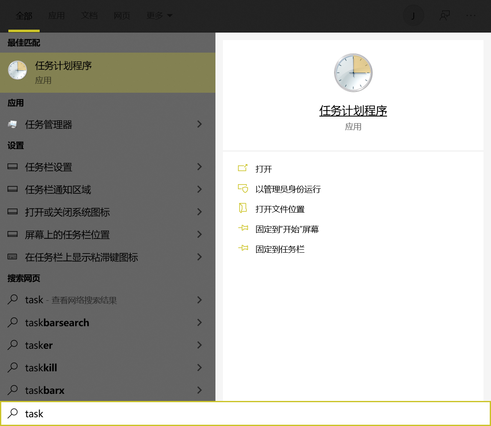
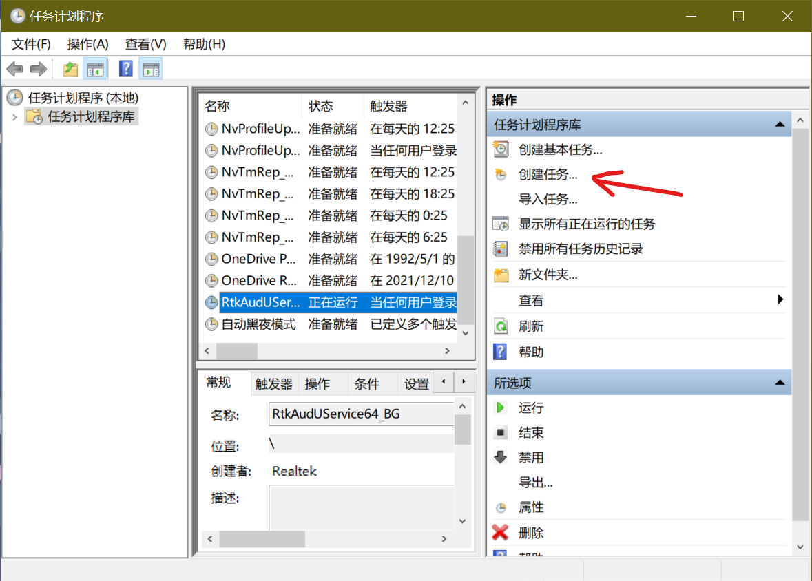
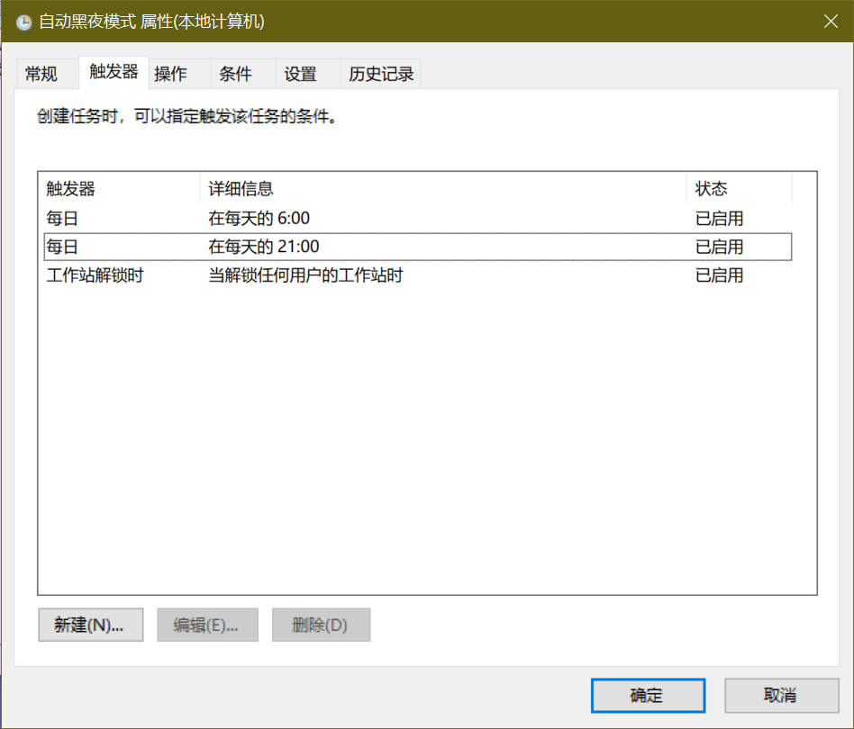
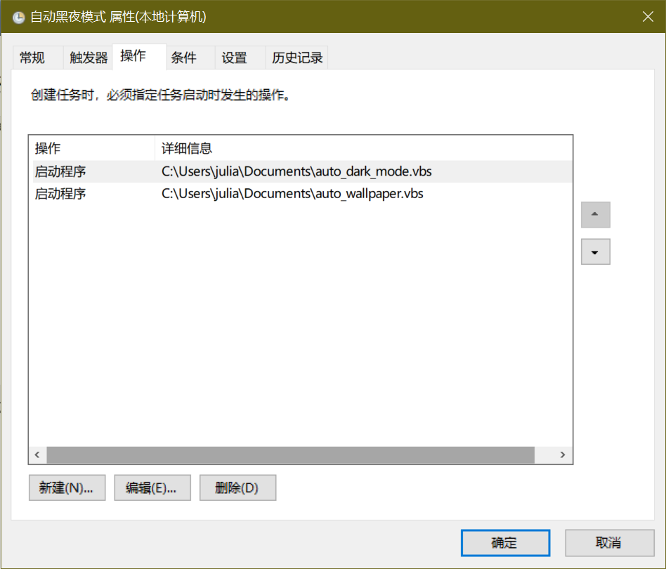

# win-auto-dark

Automatically switch dark mode of Win10.

## Guidance

中文用户可以看[这篇文章](https://notes.cerallin.top/2022/01/05/如何使Windows自动切换深色模式以及修改壁纸/)。

### Installation

Clone this project and put it to a folder, e.g., `c:\users\julia\document\win-auto-dark`.

### Schedule tasks

1. Firstly search for task scheduler and create a task.

2. Add triggers for day, night, and on logging in.

3. Finally, add operations of scripts.

`c:\users\julia\document\win-auto-dark\auto_dark_mode.vbs` for example.

### LICENSE

    THE SOFTWARE IS PROVIDED "AS IS", WITHOUT WARRANTY OF ANY KIND, EXPRESS OR
    IMPLIED, INCLUDING BUT NOT LIMITED TO THE WARRANTIES OF MERCHANTABILITY,
    FITNESS FOR A PARTICULAR PURPOSE AND NONINFRINGEMENT. IN NO EVENT SHALL THE
    AUTHORS OR COPYRIGHT HOLDERS BE LIABLE FOR ANY CLAIM, DAMAGES OR OTHER
    LIABILITY, WHETHER IN AN ACTION OF CONTRACT, TORT OR OTHERWISE, ARISING FROM,
    OUT OF OR IN CONNECTION WITH THE SOFTWARE OR THE USE OR OTHER DEALINGS IN THE
    SOFTWARE.
